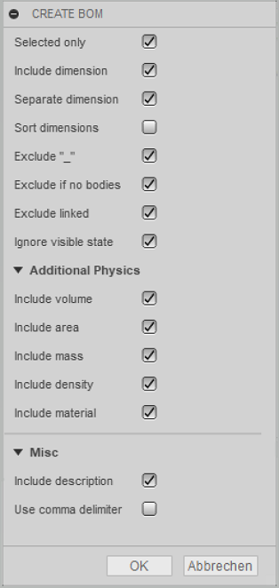
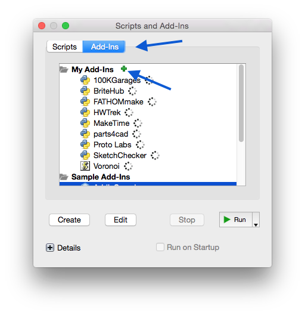
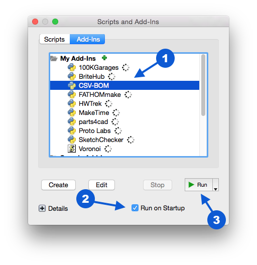

# CSV-BOM
Creates a bill of material and cut lists from the browser components tree in Autodesk Fusion360.

## General Usage Instructions
After [installation](#installation), go to the toolbar "Create" submenu and choose "Create BOM". A dialog appears which shows provided options to control the CSV output. Click OK and a save file dialog comes up. Name your file and click OK. After creating the file a message box popups with the information that the file has successfully created. Open a suitable app which can handle CSV formatted files. Import the CSV file and voila the BOM of your design is showing.  
There is also an option to generate cut lists for woodworking projects. They can be used in conjunction with a software by [Gary Darby](http://www.delphiforfun.org/Programs/CutList.htm) to optimize panel use.

### Supportet options

* **Selected only**
> Means that only selected components will be exported to CSV.

* **Include dimension**
> Exports the accumulated bounding box dimension of all solid bodies on first level whithin a component.

* **Separate dimensions**
> Places the dimension values in separate CVS output columns.

* **Sort Dimensions**
> If you are cutting your parts out of any kind of panelized material (i.e. plywood), you want the height of the part usually be the thickness of your material. 
If you select this option, the dimensions are sorted to accommodate this, no matter how your part is oriented in your model. 
The smallest value becomes the height (thickness), the next larger the width and the largest the length.

* **Exclude "_"**
> Often users sign components with an underscore to make them visually for internal use. This option ignores such signed components.
> If you deselect this option another option comes up which is descripted next.

* **Strip "_"**
> You want underscore signed components too? No problem, but you dont want the underscore in the outputted component name? Then this option is right for you. It strippes the underscore away.

* **Exclude if no bodies**
> Components without a body makes no sense. Activate this option to ignore them.

* **Exclude linked**
> If linked components have there own BOM, you can exclude them to keep your BOM lean and clean.

* **Ignore visible state**
> The component is not visible but it should taken to the BOM? Ok, activate this option to do that.

### Supported physical options

* **Include volume**
> Includes the accumulated volume for all bodies at first level whithin a component.

* **Include area**
> Includes the accumulated area for all bodies at first level whithin a component.

* **Include mass**
> Includes the accumulated mass for all bodies at first level whithin a component.

* **Include density**
> Add's the density of the first body at first level found whithin a component.

* **Include material**
> Includes the material names as an comma seperated list for all bodies at first level whithin a component.

### Cut List

* **Generate Cut List**
> Generates a file that can be used in the [cut list optimization software by Gary Darby](http://www.delphiforfun.org/Programs/CutList.htm). 
This is especially helpful in woodworking projects and allows to optimize panel use.
The file is saved under the same name as the BOM but with a "_cutList.txt" ending.
Note: If the cut list software is not able to read your dimensions properly, try changing the option "Use comma delimiter" in CSV-BOM (see below).

### Misc

* **Include description**
> Includes the component description. To edit, right click on a component and select _Properties_ in the submenu.

* **Use comma delimiter**
> If checked CSV-BOM will replace the dot decimal delimiter with a comma. This is useful for all countries that uses a comma for float decimal delimiters.
> As a benefit of that option, Applications like Apple Numbers, MS-Excel or OpenOffice can handle these CSV-entries as native numbers instead of simple text.

* ...

---

## Installation

1. Checkout the repository from Github or get the ZIP-package [here](http://www.github.de/macmanpb/CSV-BOM/archive/master.zip)
2. If you have checked out the repo, you can skip point 3
3. Extract the content of the downloaded ZIP to a preferred location
4. Open Fusion360 and load the Add-Ins dialog

	

5. To add the CSV-BOM Add-In, click on the Add-Ins tab and then on the small plus icon.

	

6. Locate the unzipped _CSV-BOM-master_ folder, open it and choose _CSV-BOM.py_ and click **OK**

7. The Add-In is now listed but not running. Select the _CSV-BOM_ entry, activate _Run on Startup_ and click _Run_

	

After _Run_ was clicked the Add-Ins dialog closes automatically.
Check the _Create_ toolbar panel! CSV-BOM is ready to use ;-)

